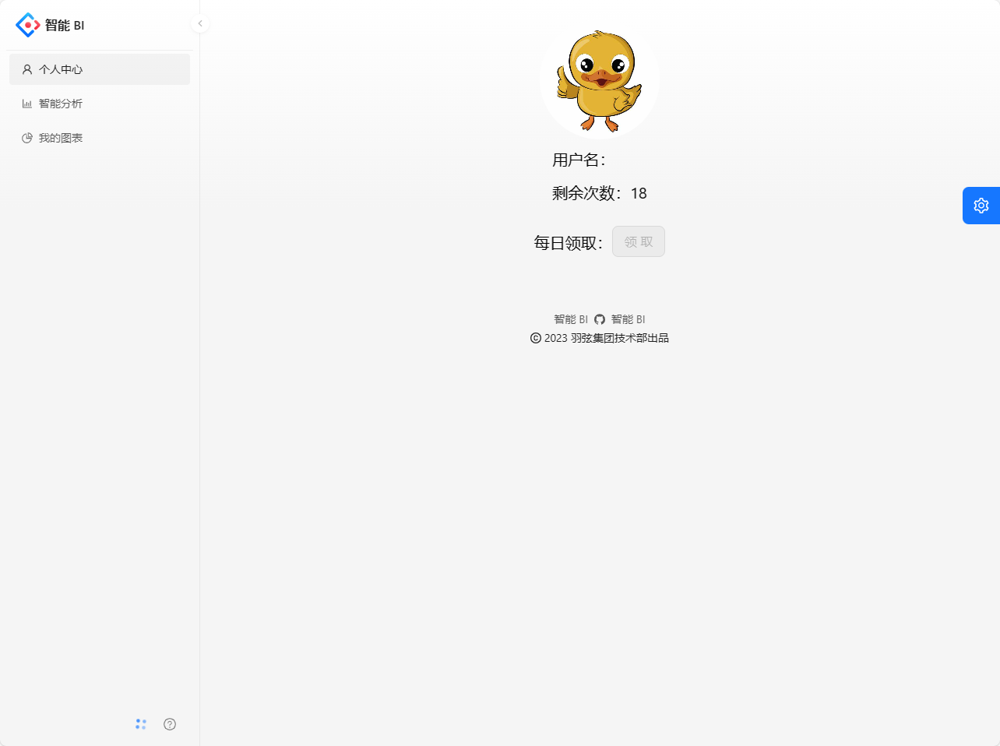

# 智能BI平台

## 项目简介

基于AIGC的智能数据分析平台，区别于传统的BI平台，用户只需要导入原始数据集，并输入分析诉求，就能自动生成可视化图表及分析结论。

## 在线访问地址
https://aigc.codelearn.top

## 技术选型

#### 前端
- React 18
- Ant Design Pro 5.x 脚手架
- Umi 4 前端框架
- Ant Design 组件库
- Echarts 可视化库
- OpenAPI 前端代码生成

#### 后端
- Spring Boot
- MySQL 数据库
- MyBatis-Plus 及 MyBatis X 自动生成
- Redis + Redisson 限流
- RabbitMQ 消息队列
- 鱼聪明 AI SDK（https://www.yucongming.com）
- JDK 线程池及异步化
- Easy Excel 表格数据处理
- Swagger + Knife4j 接口文档生成
- Hutool、Apache Common Utils 等工具库

## 项目架构图

## 启动项目
- 执行 sql目录下的sql文件
- 修改yaml配置文件中关于数据库、redis、rabbitmq的配置
- yaml配置文件中设置鱼聪明AK、SK
- 修改 src/main/java/com/yuxian/yubi/enums/AIModelEnum.java 类中的模型ID常量

